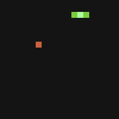
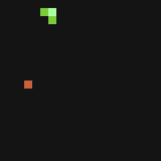
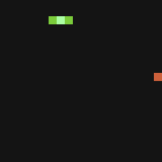
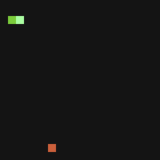
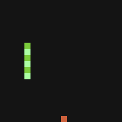
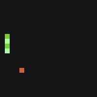
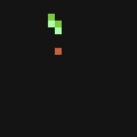

# sNNake (2017)
## A neural network programmed in JAVA to play Snake (2017)

This was a project for uni where i had to code a neural network in an object oriented manner. 
I chose JAVA and i wanted to be related with a game so i selected the Snake due to his simplicity. 

Here it's an example of the end product:

  

-------------------
I trained it placing the snake with a random shape into random places and asking where it thinks it would be the best option. 
I compute the diference between the guess option and the right one and backprop the result. 

This are 3 examples changing the learning rate and number of epochs

  
  
  

-------------------

Also, i found out that the snakes wasn't able to turn without colliding. 
Therefore i change the training in order to not only ask for the current movement but also n numbers ahead, i called it continuation value.

Here are some examples changing the continuation value to 1, 2 or 4
 

  
  
  

------------------

If you want to try it out, these are the commands:

SPACE 	= Train the network
A     	= Change to automatic/manual mode
W,A,S,D = Movement (only in manual mode)

-------------------

Link to Documentation (Spanish):

[Link](https://docs.google.com/document/d/17Ei6uatSuve8_-Oeoi2MqiXI9mek3Nz7VTWpr3EHNC0/edit?usp=sharing)
